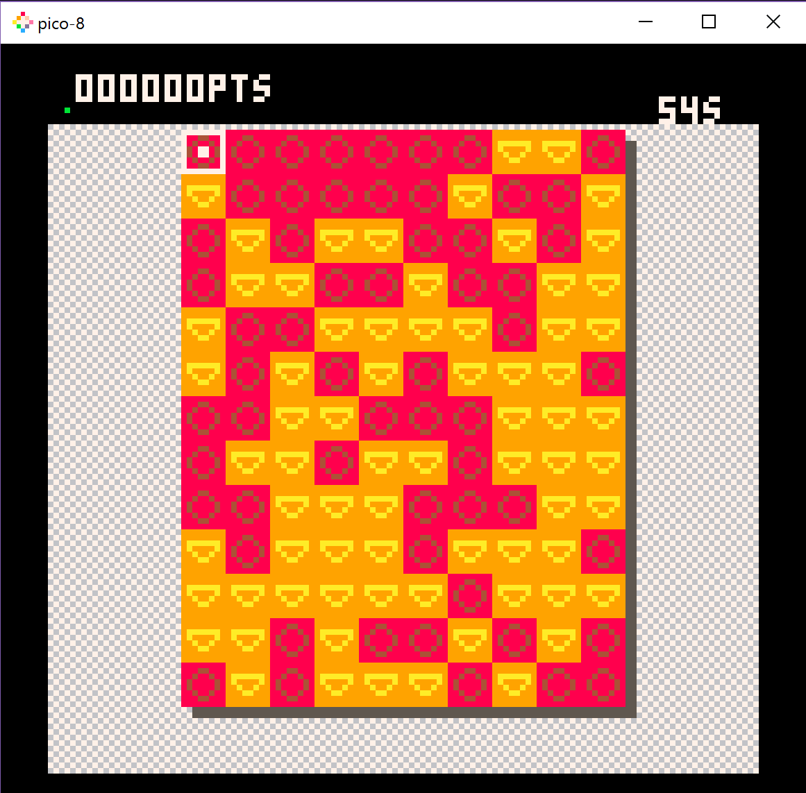
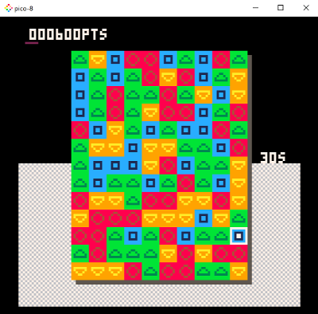

# HarshQuad on Pico-8
A small demake of HarshQuad made with [Pico-8](http://www.lexaloffle.com/pico-8.php).

  
## How to play
Make the biggest rectangles with the same colored corners. The bigger the rectangle the more points and time you'll get.
To play, simply use 'c' and arrow keys. Press 'c' and move the selection to the opposite corner.

## Side note
Please note that this demake was done during a game jam and was my very first time on pico-8.
